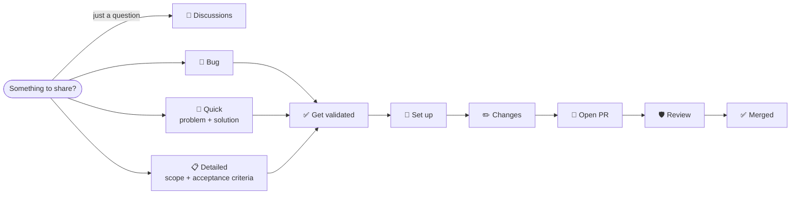

# Contributing to the AIDD Framework

## 👥 How to contribute

One path, open to everyone ([roles](./GOVERNANCE.md#-roles)). 



1. Just a question? → [Discussions](https://github.com/ai-driven-dev/framework/discussions).
2. **Open an issue** — [🐛 Bug Report](https://github.com/ai-driven-dev/framework/issues/new?template=bug_report.yml), [🌱 Quick Contribution](https://github.com/ai-driven-dev/framework/issues/new?template=quick_contribution.yml), or [📋 Detailed Contribution](https://github.com/ai-driven-dev/framework/issues/new?template=detailed_contribution.yml).
3. **Get it validated** — a Certified Member or Maintainer moves it to `Todo`. Green light.
4. **Want to build it yourself?** → [Set up](#-set-up). Anyone can pick up a validated issue, not just the person who opened it.
5. **Open your PR** → [Open a pull request](#-open-a-pull-request).

## 📜 Principles

What holds for every contribution, whatever you're building:

- **No slop** — read every line before proposing it.
- **Spend tokens like they cost something.**
- **Claude Code syntax only** — skills, agents, and rules are authored in Claude Code syntax (the [CLI](./cli/) adapts a per-tool archive at release).
- **Follow the skill structure** → [`ARCHITECTURE.md`](docs/ARCHITECTURE.md), use the `/aidd-context:04-skill-generate`.
- **Evolve the memory** → [`aidd_docs/memory/`](aidd_docs/memory/).

## 🔧 Set up

Requires **Node 22.12+**, **pnpm**, **jq**, **python3**, **pipx**.

```bash
make setup   # deps, git hooks, registers the marketplace, installs plugins into Claude + Codex
```

`make` lists every target; `make doctor` checks your environment, `make check` runs the pre-commit checks.

## ✏️ Make your change

- **Follow the [Principles](#-principles).**
- **Test locally** — run `make reload`, restart your session(s). Test in Claude *and* one other tool (e.g. Codex).
- **Commit** — `<type>(<scope>): description`, one scope per commit → [convention](aidd_docs/memory/vcs.md#commit-convention).

## 🔀 Open a pull request

- **Branch off `next`, target `next`** → [routing table](aidd_docs/memory/vcs.md#types).
- **Fill the [PR template](.github/PULL_REQUEST_TEMPLATE.md)** — what changed, how you solved it.
- **A Maintainer review gates every merge** → [`GOVERNANCE.md`](./GOVERNANCE.md#-code-decisions).

## 📚 Reference

[`ARCHITECTURE.md`](docs/ARCHITECTURE.md) · [`CREATE_PLUGIN.md`](docs/CREATE_PLUGIN.md) · [`GLOSSARY.md`](docs/GLOSSARY.md)

---

■ [Back to framework](./README.md)
