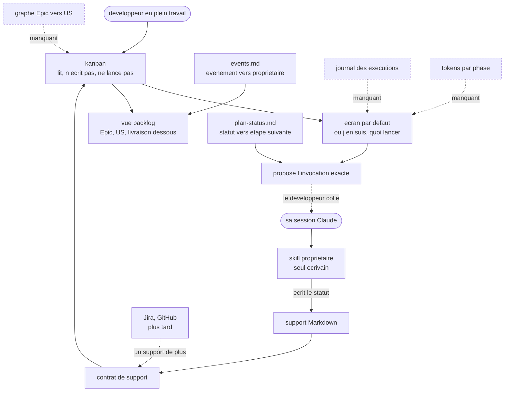

# Product Brief: aidd kanban

A terminal screen inside the `aidd` CLI for developers building with the framework: it reads the project's backlog and delivery documents, shows what is in progress, and hands over the exact invocation for the next step. It reads and proposes; it never writes and never launches anything itself. It exists as working code today, hidden from `aidd --help`.

## Opportunity

The framework produces documents faster than anyone can read them. On one machine, seven projects carry an `aidd_docs/`, from 10 to 259 markdown files. Each plan, phase, spec and review records a status in its frontmatter, and nothing gathers them. A developer returning to a project opens folders, greps, or asks the agent to summarise, and gets an answer that costs tokens and cannot be trusted twice.

The framework asks its users to write state down, then gives them no way to read it back. `plan-status.md` has said as much from the start: the plan's status field exists "for kanban views". The field was designed for a screen that was never built. The cost is not the reading, it is the thread lost between sessions: what was in flight, what was blocked, what came next.

Two things make now the moment. The typed backlog with Epics, Stories, Tasks, Spikes and Defects is being defined right now on an unmerged branch; a reader that has to consume it can still influence what gets recorded, and will not be able to later without migrating every document already written. And the viewer already exists, moved and green, so the question is what it becomes rather than whether to build one.

## Audience and Context

Developers using AIDD to build. They work in a terminal, run skills through Claude Code, and their attention sits on one task at a time, not on a portfolio. They open the tool mid-work, having lost the thread, wanting two things in the first seconds: where am I, and what do I run next.

They already have an agent session open, or are about to. The screen lives beside it, in its own terminal, because a full-screen terminal view cannot be driven from inside an agent's tool call.

The evidence here is thin and must be read as such. Two people have used this tool, and both are its authors. Nothing has been observed about how anyone else keeps track of their AIDD work. What is observed is the artefact, not the behaviour.

## Product Bet

If a developer can open one command and see their current task, its blocked phase, and the exact invocation for the next step, they stop navigating folders and stop paying an agent to summarise state that is already written down. The screen earns its place by being faster to consult than asking, and truthful enough to be consulted twice.

## Evidence and Assumptions

| Claim | Status | Basis or next check |
| --- | --- | --- |
| Seven projects on one machine carry an `aidd_docs`, from 10 to 259 markdown files | evidence | `find` over `~/Projects`, 2026-07-31 |
| The framework already intended a board: the plan status field exists "for kanban views" | evidence | `plugins/aidd-dev/skills/01-plan/references/plan-status.md`, first line |
| The next step is derivable from the status the framework already records | evidence | same file: each status names who writes it and when — plan creation, the implement step, the review step |
| The recorded state is already inconsistent enough to be unreadable as a board | evidence | `findings.md`: a column headed `read-only — diagnose only, no fixes`, another `findings-1-2-done`, six `- plan: unknown` in one cell |
| `--type` cannot work against this framework's own documents | evidence | the plan template defines `objective` and `status` only; `--type plan` returns nothing on `cli` |
| A project with documents but no frontmatter reads as empty | evidence | breathflow, 10 files, "No task documents found." |
| Launching a skill headlessly costs plan quota or API spend on every invocation | evidence | `aidd-orchestrator` local-mode docs, which treat `claude -p` cost as a first-class knob |
| The board's card is an Epic or a Story, with delivery beneath it | decision | 2026-08-02 |
| The default screen answers "where am I, what do I run next"; the portfolio is a second view | decision | 2026-08-03 |
| Kanban proposes the invocation; the developer runs it in the session they already have | decision | keeps one agent on the repo, spends nothing, adds no dependency on Claude Code being installed |
| Kanban never writes an artefact; the owning capability does | decision | `events.md` for backlog, `plan-status.md` for delivery — both already name the writer |
| Kanban reads through the backlog's support abstraction, Markdown first | decision | `supports.md` makes the support pluggable; keeps the tool offline and unauthenticated |
| A task folder serves as the artefact's identity, so delivery attaches with no new field | decision | `change-set.md` already allows a project-relative path as identity |
| Developers want a screen rather than asking the agent | assumption | the riskiest one; nothing observed. See Validation |
| The overflow found at 164 and 259 documents dissolves once cards are Epics and Stories | assumption | untested; no project has Epics yet, so their count is unknown |
| A proposed invocation the developer must paste is still worth the trip to the screen | assumption | if pasting is the friction that kills it, the bet fails on the last step |
| The backlog design this brief consumes can still change | assumption | it lives on an unmerged branch; re-check at merge |

## Boundaries

- Addresses: reading the backlog and delivery documents from the local Markdown support, showing current work and next runnable step, offering the full backlog as a second view, and handing over the exact invocation to run.
- Leaves out: writing any artefact, spawning any process or spending any quota, reading Jira or GitHub in this first form, producing the execution journal and token accounting the cockpit will later need, and defining the requirements of any screen.

## Success

A developer resumes a project by opening the screen rather than by opening files or asking the agent, and the step they run next comes from it. The signal that it worked is that it gets opened again the next day without being suggested. The signal that it failed is that it gets opened once and abandoned, which means it was slower or less trustworthy than asking.

## Validation and Feedback

The next check targets the riskiest assumption, that a developer wants this at all. The command already exists and is hidden, which makes the check nearly free: use it as the way to resume work on `framework` and `cli` for two weeks, and record every time the screen was opened and every time a folder or the agent was used instead. If the folder wins, the bet is wrong regardless of how good the board looks.

Once in use, the signal is what happens after opening: whether the proposed invocation is actually run, or the developer leaves the screen to go read a file. Reviewed at the point where unhiding the command is proposed. It can change the product decision itself: a screen consulted then abandoned for the file is a screen that should become a summary, not a board.

## Product View

## Open Decisions

- Whether the current interactive view survives. Its columns are keyed by literal status, which the findings show breaks on real data, and the typed backlog defines a checked status vocabulary instead. What was moved is roughly the delivery half of the target; the layer above it does not exist.
- Whether identity and link fields enter the backlog templates now, while they are being written, or the graph is inferred from folders and migrated later.
- Where the invocation goes once proposed: printed, put on the clipboard, or both. Clipboard means a platform-specific dependency the CLI does not have today.
- When the execution journal and token accounting are requested from whoever owns the run pipeline.
