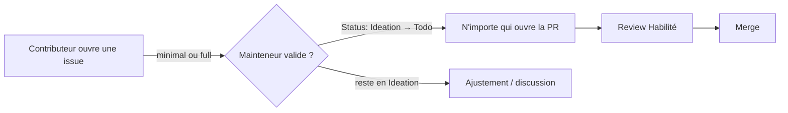

<!-- Fill or omit these sections; never add, rename, or reorder one. -->

# Instruction: Flux, gouvernance et templates

## Architecture projection

> Tree of the final files. ✅ create · ✏️ modify · ❌ delete

```txt
.
├── CONTRIBUTING.md ✏️
├── GOVERNANCE.md ✏️
└── .github/
    └── ISSUE_TEMPLATE/
        ├── feature_request.yml ✏️ (→ template minimal)
        └── roadmap.yml ✏️ (→ template full)
```

## User Journey



## Tasks to do

### `1)` Réécrire CONTRIBUTING.md

> Remplacer le tableau d'entrée par rôle par le flux unique issue-first, ajouter la section Principes.

1. Remplacer la section "👥 Who can contribute" par le flux unique : issue (minimal ou full) → mainteneur valide (bascule Status `Ideation → Todo` sur le Roadmap board) → n'importe qui ouvre la PR.
2. Insérer le mermaid flow ci-dessus (ou équivalent), pensé pour être suivi en cliquant ou collé tel quel à une IA.
3. Ajouter une section "📜 Principes" : anti AI-slop, éviter le gaspillage de token, suivre la structure des skills, faire évoluer la memory. Ne pas réécrire la relecture ligne-à-ligne (déjà couverte par la case à cocher du `PULL_REQUEST_TEMPLATE.md`).
4. Retirer toute mention du vote roadmap (≥7 jours) pour ces issues.

### `2)` Réécrire GOVERNANCE.md

> Aligner les droits Certifié/Habilité sur le nouveau flux.

1. Dans la table des rôles, remplacer "Open pull requests (framework + courses)" par "Valider les issues de contribution (triage)" sur la ligne Certifié.
2. Laisser la ligne Habilité inchangée (merge, veto qualité, nomination).
3. Vérifier que § Roadmap voting ne laisse pas croire qu'un vote est requis pour valider une issue de contribution.

### `3)` Repurposer feature_request.yml en template minimal

> Un template court, ouvert à tout contributeur, plus lié au vote supprimé.

1. Retirer le texte d'intro qui annonce "popular ideas get promoted to a roadmap vote".
2. Recadrer l'intro pour tout contributeur (pas seulement une proposition de contenu).
3. Garder les champs `problem`/`solution` existants tels quels.

### `4)` Repurposer roadmap.yml en template full

> Le même formulaire détaillé, ouvert à tous au lieu de réservé aux mainteneurs.

1. Retirer "For maintainers planning framework work" et toute formulation réservant le template.
2. Garder les champs `problem`/`scope`/`acceptance`/`prior-art`/`out-of-scope` tels quels.
3. Nom et description du template : libres, à choisir à l'écriture.

## Test acceptance criteria

<!-- Each criterion is an observable behavior, not a command. -->

| Task | Acceptance criteria              |
| ---- | -------------------------------- |
| 1    | `CONTRIBUTING.md` n'a plus de tableau d'entrée par rôle ; le flux issue-first et la section Principes sont visibles |
| 2    | La ligne Certifié de `GOVERNANCE.md` ne mentionne plus l'ouverture de PR, mentionne la validation d'issue |
| 3    | `feature_request.yml` ne référence plus de vote roadmap, reste utilisable par n'importe quel contributeur |
| 4    | `roadmap.yml` ne se présente plus comme réservé aux mainteneurs, ses champs sont intacts |
