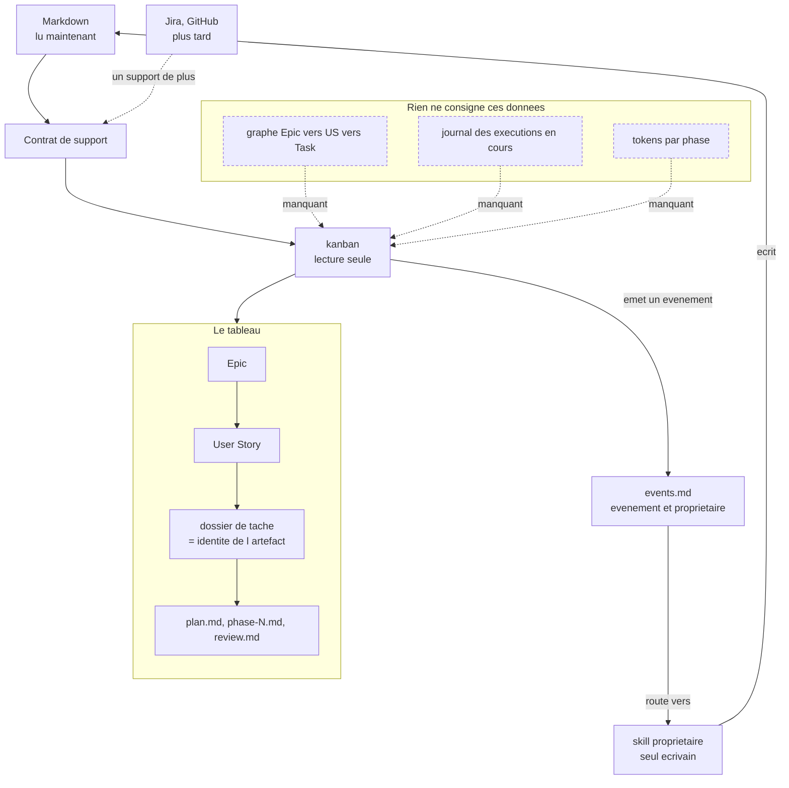

# The kanban as the framework's control surface

What was moved into `framework/kanban/` reads one folder of markdown and paints its frontmatter into columns. What it is meant to become is the place you open to see where a project stands, drill from a product outcome down to the phase currently running, and start the work from there. The board's unit stops being a file and becomes a backlog artifact: a card is an Epic or a User Story, and the delivery documents — the plan, its phases, the review — hang underneath it as the evidence of progress.

Kanban stays a reader. Managing the backlog does not mean kanban writes frontmatter; it means kanban emits the lifecycle event and the owning capability writes. That contract already exists on the backlog branch, in `events.md`: Epic create, revise, order, start, complete; Story slice; Task classify; Spike investigate; Defect assess — each with its owner, and the instruction to route to it. Kanban does not have to invent what it triggers, only which event it emits.

The board reads the backlog through the support abstraction rather than through the filesystem. Markdown is the only support it reads at first, so it stays local, offline and unauthenticated; Jira or GitHub later become another support, not a rewrite. A backlog stored in a support kanban has not read leaves the picture partial, and the rule is already written: say so, never present it as an empty backlog.

## What Is Clear

- A card is an Epic or a User Story. Plans, phases and reviews are delivery detail beneath it, never cards of their own.
- A backlog artifact's identity may be a project-relative path, which `change-set.md` already allows. A task folder therefore *is* the artifact's identity, and the delivery documents sit under it with no new frontmatter field to invent. The cost is accepted: one artifact maps to one delivery folder, and one folder serves one artifact.
- Kanban reads through the backlog system's support contract, Markdown first. Local, offline, no authentication. Another support is an addition, not a rewrite.
- Kanban never writes an artifact. It emits an event from `events.md` and the owning capability performs the mutation, so the frontmatter keeps exactly one writer.
- The five artifact types are Epic, Story, Task, Spike and Defect. A `plan.md` is none of them, which is why the delivery link had to be settled rather than assumed.
- Three of the four ambitions are blocked on data nobody records yet, and this is the central constraint, not a detail. Linking artifacts needs a graph the templates do not carry today. Showing what is currently executing needs a run journal that exists nowhere in the framework. Showing tokens per phase needs accounting nothing produces. Launching a skill is the only one buildable now, because kanban already knows which task folder is selected and `events.md` already says who owns what.
- The board reveals data problems rather than fixing them. `--type plan` returns nothing because the plan template never emits a `type`. A column reads `read-only — diagnose only, no fixes` because someone put a sentence in a `status:` field. A cell repeats `- plan: unknown` six times because the plan template has no `name`. A project with ten documents prints "No task documents found." because none carry frontmatter. Every one of these is fixed upstream, in the templates and the convention, never in the view.
- With the backlog artifact as the unit, the vertical overflow found at 164 and 259 documents most likely dissolves: a project has tens of Epics and Stories, not hundreds of markdown files, and the files fold under their artifact. Scrolling drops from first obstacle to comfort.
- Three hard constraints and two non-goals of the original spec are now dead: reading only `aidd_docs/`, making no network calls, and refusing any integration with an external issue tracker. This is no longer an evolution of Francois's tool; it is a different product that reuses its lower half.

## Still Open

- Metrics and live execution are wanted but have no source. Nothing in the framework records a run, its phases, or its token cost. Whether the brief commits to that instrumentation or names it as a dependency on someone else's work is undecided.
- What survives of the current code. The `TaskGroup` model — a directory, a parent document, its sub-documents — is the delivery layer and stays. The layer above it, backlog artifacts read through the support contract, does not exist in any form. Roughly, what was moved is the bottom half of the target.
- Whether the interactive view keeps its current shape at all once the unit changes, or whether columns keyed by literal status survive the move to Epics and Stories, whose status vocabulary is defined and checked rather than free text.
- The backlog taxonomy is still in flight on `codex/refactor-pm-backlog` and not merged to `next`. Anything decided here depends on a branch that can still move.

## Next Move

Write the product brief on this, and decide there whether live execution and token metrics are in scope or are a dependency to be requested from whoever owns the run pipeline.
