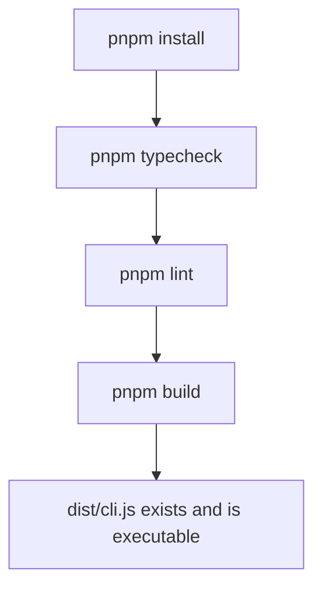

# Instruction: Project bootstrap & tooling

## Architecture projection

```txt
.
├── package.json           ✅ create
├── tsconfig.json          ✅ create
├── tsup.config.ts         ✅ create
├── biome.json             ✅ create
├── vitest.config.ts       ✅ create
├── .gitignore             ✅ create
└── src/
    └── cli.ts             ✅ create (empty entrypoint, filled by later phases)
```

## User Journey



## Tasks to do

### `1)` Scaffold the package manifest

> Establish the npm package, its bin entry, engines, and scripts.

1. Create `package.json`: name `cli-kaban`, `type: module`, `bin: { "cli-kaban": "dist/cli.js" }`, `engines.node >= 20`, `packageManager: pnpm@9`.
2. Add scripts: `build` (tsup), `dev` (tsup --watch), `test` (vitest run), `test:watch` (vitest), `typecheck` (tsc --noEmit), `lint` (biome check .), `format` (biome format --write .).
3. Add dependencies: `commander`, `gray-matter`, `ink`, `react`.
4. Add devDependencies: `typescript`, `tsup`, `vitest`, `@biomejs/biome`, `@types/node`, `@types/react`, `ink-testing-library`.

### `2)` Configure the toolchain

> Mirror the sibling `aidd-cli` project's TypeScript/build/lint conventions, adapted for Ink's JSX.

1. Create `tsconfig.json`: `strict: true`, `module`/`moduleResolution: NodeNext`, `jsx: react-jsx`, `outDir: dist`, `include: src/**/*` and `tests/**/*`.
2. Create `tsup.config.ts`: entry `src/cli.ts`, format `esm`, target `node20`, shebang banner, `clean: true`.
3. Create `biome.json`: recommended linter rules, 2-space indent, double quotes, excluding `dist`/`node_modules`/`coverage`.
4. Create `vitest.config.ts` with default Node environment.
5. Create `.gitignore`: `node_modules`, `dist`, `coverage`.
6. Create `src/cli.ts` as a minimal placeholder entrypoint (a shebang and a no-op `main()`), so the build has something to compile.

## Test acceptance criteria

| Task | Acceptance criteria                                                                    |
| ---- | --------------------------------------------------------------------------------------- |
| 1... | Running the package's install step succeeds and produces a lockfile.                    |
| 2... | Running the project's typecheck step reports zero errors against the placeholder entrypoint. |
| 2... | Running the project's lint step reports zero errors against the scaffolded files.        |
| 2... | Running the project's build step produces a `dist/cli.js` file starting with a shebang line. |
