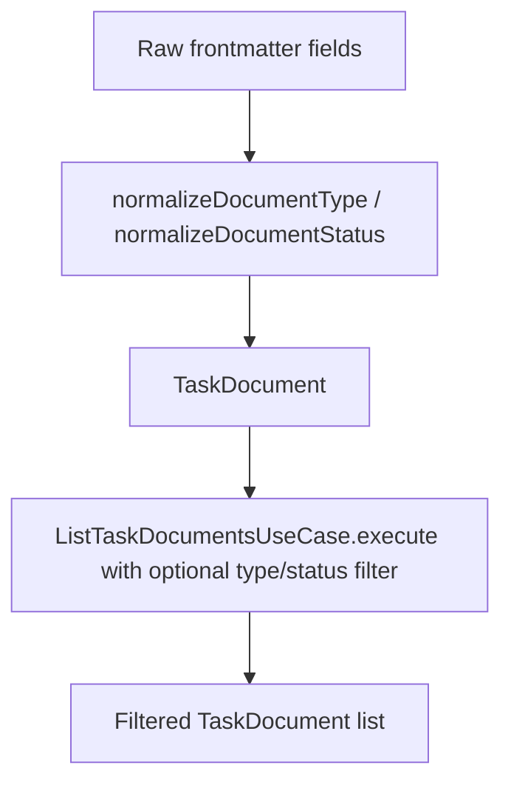

# Instruction: Domain & application layer

## Architecture projection

```txt
src/
├── domain/
│   ├── models/
│   │   ├── task-document.ts        ✅ create
│   │   ├── document-type.ts        ✅ create
│   │   └── document-status.ts      ✅ create
│   └── ports/
│       └── task-document-repository.ts  ✅ create
└── application/
    └── use-cases/
        └── list-task-documents.ts  ✅ create
tests/
├── domain/
│   ├── document-type.test.ts       ✅ create
│   └── document-status.test.ts     ✅ create
└── application/
    └── list-task-documents.test.ts ✅ create
```

## User Journey



## Tasks to do

### `1)` Domain models and normalization rules

> Define the shape of a task document and the rule that missing type/status never gets dropped.

1. In `document-type.ts`, export an `UNKNOWN_DOCUMENT_TYPE` constant and a `normalizeDocumentType(raw: string | undefined): string` function returning the constant when `raw` is absent, and `raw` unchanged otherwise.
2. In `document-status.ts`, export an `UNKNOWN_DOCUMENT_STATUS` constant and a `normalizeDocumentStatus(raw: string | undefined): string` function with the same rule.
3. In `task-document.ts`, define the `TaskDocument` interface: `name`, `description`, `type`, `status`, `filePath` — all explicitly typed strings, no `any`.

### `2)` Repository port

> Declare the boundary the infrastructure layer must implement, without depending on it.

1. In `task-document-repository.ts`, declare `TaskDocumentRepository` with one method: `findAll(projectPath: string): Promise<TaskDocument[]>`.

### `3)` List use case

> Orchestrate: fetch through the port, then narrow by the optional filters.

1. In `list-task-documents.ts`, define `ListTaskDocumentsUseCase`, constructed with a `TaskDocumentRepository`.
2. Add `execute(projectPath: string, filters: { type?: string; status?: string }): Promise<TaskDocument[]>`: calls `findAll`, then keeps only documents matching `filters.type` when supplied and `filters.status` when supplied.

## Test acceptance criteria

| Task | Acceptance criteria                                                                                                 |
| ---- | --------------------------------------------------------------------------------------------------------------------- |
| 1... | Given no raw type, normalization returns the unknown-type constant; given `"plan"`, it returns `"plan"` unchanged.       |
| 1... | Given no raw status, normalization returns the unknown-status constant; given `"blocked"`, it returns `"blocked"` unchanged. |
| 3... | Given a fake repository returning a fixed set of documents, executing with a type filter returns only matching documents. |
| 3... | Given the same fake repository, executing with a status filter returns only matching documents.                        |
| 3... | Given the same fake repository, executing with no filters returns every document unchanged.                            |
