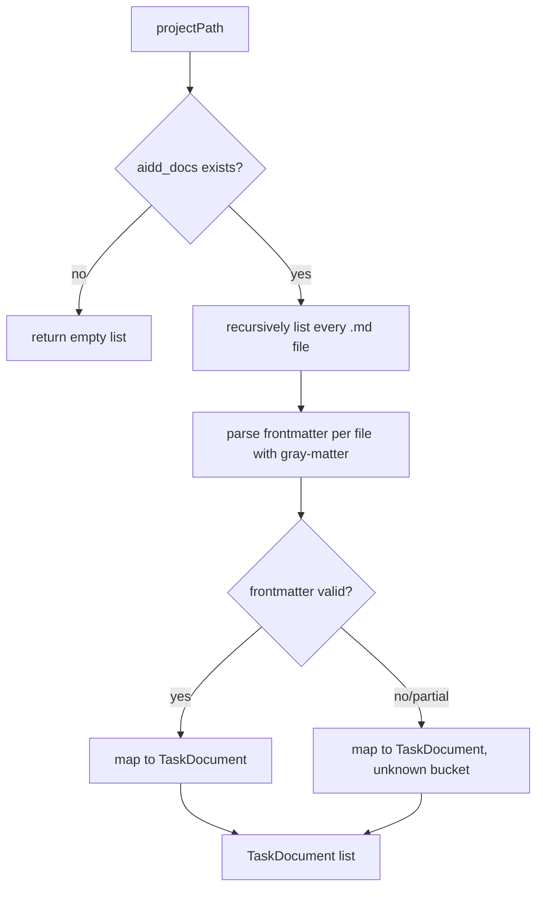

# Instruction: Infrastructure — filesystem repository

## Architecture projection

```txt
src/
└── infrastructure/
    └── filesystem/
        └── filesystem-task-document-repository.ts  ✅ create
tests/
└── infrastructure/
    └── filesystem-task-document-repository.test.ts ✅ create
```

## User Journey



## Tasks to do

### `1)` Implement the repository

> Turn a project path into a flat list of `TaskDocument`, tolerant of anything the `aidd_docs` tree throws at it.

1. In `filesystem-task-document-repository.ts`, implement `TaskDocumentRepository` as `FilesystemTaskDocumentRepository`.
2. `findAll(projectPath)`: resolve `<projectPath>/aidd_docs`; if it does not exist, return `[]`.
3. Recursively collect every file ending in `.md` under that directory.
4. For each file, read its content and parse frontmatter with `gray-matter`; on a parse failure, treat the frontmatter as empty rather than throwing.
5. Map each parsed result to a `TaskDocument`, running `name`/`description` through straight passthrough (empty string when absent) and `type`/`status` through the domain normalization functions from phase 2.

## Test acceptance criteria

| Task | Acceptance criteria                                                                                                     |
| ---- | --------------------------------------------------------------------------------------------------------------------- |
| 1... | Given a temp directory with an `aidd_docs` tree containing markdown files with valid frontmatter, one `TaskDocument` is returned per file with the parsed fields. |
| 1... | Given a markdown file missing its `status` field, the returned document carries the unknown-status bucket instead of throwing. |
| 1... | Given a markdown file with malformed YAML frontmatter, the returned document still exists, bucketed unknown, and no error is thrown. |
| 1... | Given a project path with no `aidd_docs` directory, `findAll` resolves to an empty list.                                |
