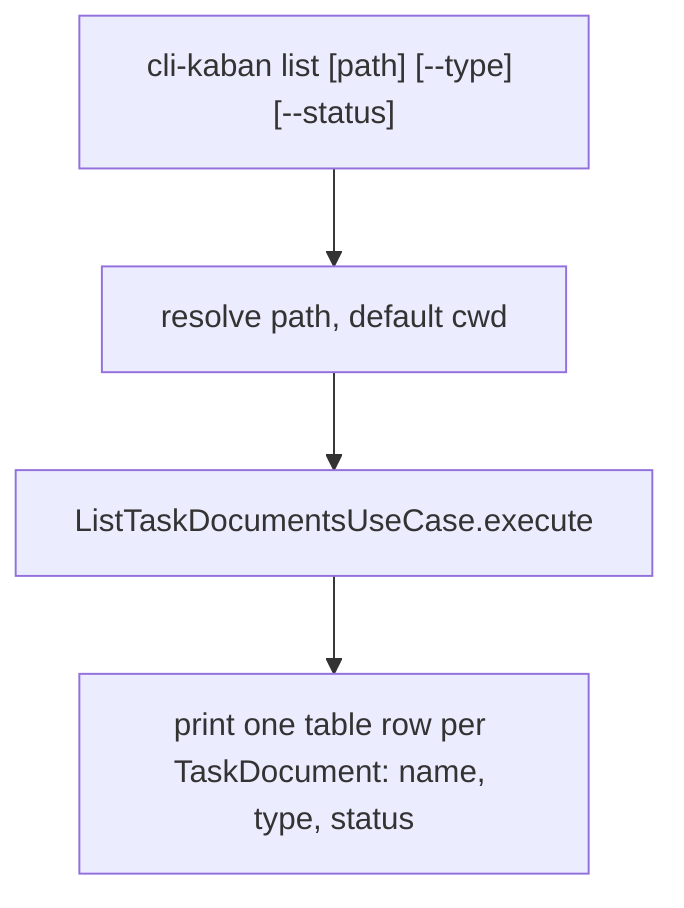

# Instruction: Presentation — scriptable table command

## Architecture projection

```txt
src/
├── cli.ts                                    ✏️ modify (register `list` command)
└── presentation/
    └── commands/
        └── list-command.ts                   ✅ create
tests/
└── presentation/
    └── list-command.test.ts                  ✅ create
```

## User Journey



## Tasks to do

### `1)` Wire the CLI entrypoint

> Give the placeholder entrypoint from phase 1 a real command.

1. In `cli.ts`, create a `commander` program and register the `list` command, defined in `list-command.ts`.

### `2)` Implement the `list` command

> Print a plain, pipeable table.

1. Accept an optional positional `path` argument, defaulting to `process.cwd()`.
2. Accept `--type <type>` and `--status <status>` options, both optional.
3. Build a `FilesystemTaskDocumentRepository` and a `ListTaskDocumentsUseCase`, call `execute(path, { type, status })`.
4. Print one line per returned `TaskDocument` to stdout, in columns: name, type, status (description omitted or truncated to keep lines scriptable).

## Test acceptance criteria

| Task | Acceptance criteria                                                                                                    |
| ---- | ------------------------------------------------------------------------------------------------------------------- |
| 2... | Running `list` against a project containing an `aidd_docs` folder prints one row per markdown document found, showing its name, type, and status. |
| 2... | Running `list` with no path argument targets the current working directory.                                          |
| 2... | Running `list <path> --type plan` prints only rows whose type is `plan`.                                              |
| 2... | Running `list <path> --status blocked` prints only rows whose status is `blocked`.                                    |
| 2... | Running against a project whose `aidd_docs` contains a document missing its `status` field prints that row under the unknown bucket rather than omitting it or erroring. |
