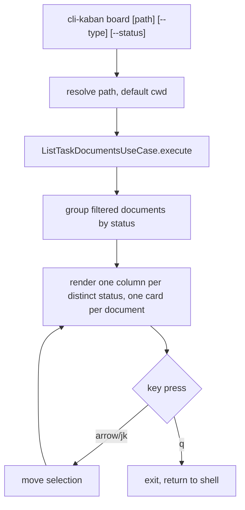

# Instruction: Presentation — interactive kanban board

## Architecture projection

```txt
src/
├── cli.ts                                    ✏️ modify (register `board` command)
└── presentation/
    ├── commands/
    │   └── board-command.ts                  ✅ create
    └── components/
        └── kanban-board.tsx                  ✅ create
tests/
└── presentation/
    └── kanban-board.test.tsx                 ✅ create
```

## User Journey



## Wireframe

```txt
+--------------------------------------------------------------------------------+
| cli-kaban — /path/to/project                                    ←/→ move  q quit|
+----------------------+----------------------+----------------------+-----------+
| pending (2)          | in-progress (1)      | reviewed (3)         | unknown(1)| (1)
+----------------------+----------------------+----------------------+-----------+
| > FID-560 plan       |   FID-559 master     |   FID-480 plan       |  DEC-002  | (2)
|   ua-build plan      |                       |   FID-548 plan       |           |
|                      |                       |   FID-561 plan       |           |
+----------------------+----------------------+----------------------+-----------+
```

1. Header: project path and the two active key hints.
2. Column headers: one per distinct status found among the (filtered) documents, with a count.
3. Cards: one per document, showing name and type; the selected card is marked `>` and highlighted.

## Tasks to do

### `1)` Build the kanban board component

> One column per status value actually present, cards navigable with the keyboard.

1. In `kanban-board.tsx`, accept a `TaskDocument[]` prop.
2. Group the documents by `status`, one column per distinct value present (including the unknown bucket when it occurs).
3. Render each document as a card (name + type) inside its status column.
4. Track a selected-card index in component state; handle arrow keys (or `j`/`k`) to move it, and `q` to exit the Ink app.

### `2)` Wire the `board` command

> Same data path as `list`, different renderer.

1. In `board-command.ts`, accept the same positional `path` and `--type`/`--status` options as the `list` command.
2. Build the same `FilesystemTaskDocumentRepository` and `ListTaskDocumentsUseCase`, call `execute(path, { type, status })`.
3. Render `<KanbanBoard documents={...} />` with Ink's `render()`.
4. In `cli.ts`, register the `board` command.

## Test acceptance criteria

| Task | Acceptance criteria                                                                                                          |
| ---- | ---------------------------------------------------------------------------------------------------------------------------- |
| 1... | Given a fixed set of documents spanning three statuses, the rendered output shows exactly one column per distinct status.      |
| 1... | Each document appears as a card under the column matching its (normalized) status.                                            |
| 1... | Sending an arrow-key input moves the highlighted selection to the adjacent card without throwing.                             |
| 2... | Running `board <path> --type plan --status blocked` renders the same set of cards that `list <path> --type plan --status blocked` prints as rows. |
| 1... | Sending the quit key unmounts the Ink app and returns control to the shell.                                                    |
