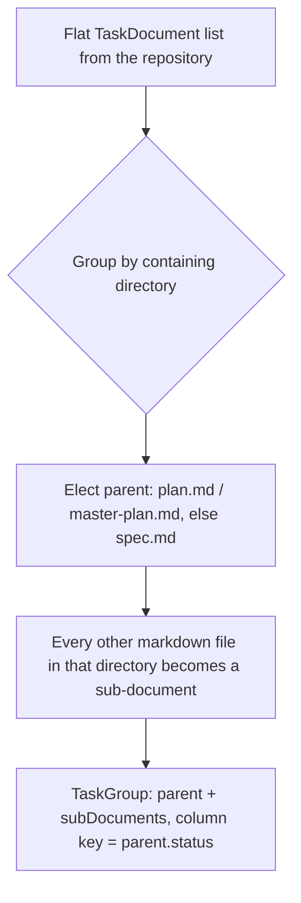

# Instruction: Domain: task grouping model

## Architecture projection

> Tree of the final files. ✅ create · ✏️ modify · ❌ delete

```txt
.
└── src
    └── domain
        └── models
            └── task-group.ts ✅
```

## User Journey



## Tasks to do

### `1)` Add the `TaskGroup` model and grouping function

> Turn a flat `TaskDocument[]` into `TaskGroup[]`, one per directory, without touching any existing model.

1. Add `src/domain/models/task-group.ts` exporting a `TaskGroup` interface (`parent: TaskDocument`, `subDocuments: TaskDocument[]`) and a pure function `groupTaskDocumentsByDirectory(taskDocuments: TaskDocument[]): TaskGroup[]`.
2. Derive each document's containing directory from `filePath` (`node:path` `dirname`).
3. Within a directory's documents, elect the parent: the one whose `filePath` basename is `plan.md` or `master-plan.md`; if neither is present, the one whose basename is `spec.md`; if none of those exist, elect the first document in the directory (stable input order) so no document is ever silently dropped.
4. Every other document sharing that directory becomes a `subDocuments` entry, in stable input order.
5. Keep this function framework-agnostic and side-effect free — no filesystem access here, it only reshapes an already-loaded list.

## Test acceptance criteria

| Task | Acceptance criteria                                                                                     |
| ---- | ---------------------------------------------------------------------------------------------------------- |
| 1... | A directory containing `plan.md` and two `phase-*.md` files groups into one `TaskGroup` with the plan as parent and both phases as sub-documents |
| 1... | A directory containing only `spec.md` (no plan yet) elects the spec as parent with no sub-documents          |
| 1... | A directory with none of the recognized filenames still produces a `TaskGroup`, electing the first document as parent instead of dropping the rest |
| 1... | Documents from different directories never end up in the same `TaskGroup`                                    |
