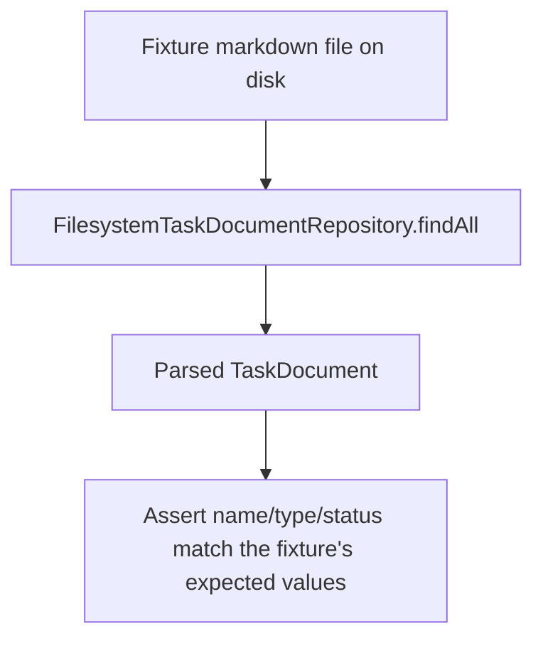

# Instruction: Fixture-verified frontmatter extraction

## Architecture projection

> Tree of the final files. ✅ create · ✏️ modify · ❌ delete

```txt
.
└── tests
    ├── fixtures
    │   └── frontmatter
    │       ├── valid-full.md ✅
    │       ├── unrecognized-status.md ✅
    │       ├── missing-type.md ✅
    │       ├── missing-status.md ✅
    │       ├── malformed-yaml.md ✅
    │       └── body-mentions-status-and-type.md ✅
    └── domain
        └── frontmatter-extraction.test.ts ✅
```

## User Journey



## Tasks to do

### `1)` Write the fixture set

> One markdown file per case the spec's hard constraints name, each realistic enough to stand for a real `aidd_docs` document.

1. `valid-full.md` — the user's own example: `name: Test name`, `type: plan`, `status: completed`, body `short description with some keywords like status or type`.
2. `unrecognized-status.md` — valid `name`/`type`, a `status` value the tool has no special case for (e.g. `archived`).
3. `missing-type.md` — valid `name`/`status`, no `type` key at all.
4. `missing-status.md` — valid `name`/`type`, no `status` key at all.
5. `malformed-yaml.md` — an unterminated/invalid YAML frontmatter block (unbalanced bracket or quote).
6. `body-mentions-status-and-type.md` — valid, fully-populated frontmatter, with a body paragraph that uses the words "status" and "type" in prose, to prove the body is never mistaken for frontmatter.

### `2)` Assert each fixture's expected extraction

> Every fixture gets its own assertion — none exists unasserted.

1. In `tests/domain/frontmatter-extraction.test.ts`, load each fixture through `FilesystemTaskDocumentRepository` and assert its resulting `name`, `type`, and `status` (or their `unknown` fallback) match what that fixture is designed to prove.
2. For `body-mentions-status-and-type.md`, additionally assert the extracted `status`/`type` equal the frontmatter values, not anything derived from the body text.

## Test acceptance criteria

| Task | Acceptance criteria                                                                                  |
| ---- | -------------------------------------------------------------------------------------------------------- |
| 1... | All six fixture files exist under `tests/fixtures/frontmatter/` and parse without throwing                |
| 2... | Running the test suite passes with every fixture's `name`/`type`/`status` individually asserted            |
| 2... | `body-mentions-status-and-type.md` extracts its real frontmatter values, unaffected by the body's wording |
