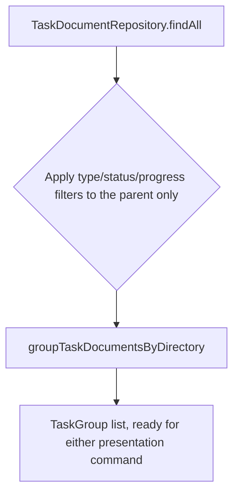

# Instruction: Application: grouped, filtered listing

## Architecture projection

> Tree of the final files. ✅ create · ✏️ modify · ❌ delete

```txt
.
└── src
    └── application
        └── use-cases
            └── list-task-documents.ts ✏️
```

## User Journey



## Tasks to do

### `1)` Filter on the parent, then group

> The existing `--type`/`--status`/`--progress` filters must keep working, now evaluated against each group's parent rather than every flat document.

1. In `src/application/use-cases/list-task-documents.ts`, call `groupTaskDocumentsByDirectory` (from phase 1) on the repository's flat result before filtering.
2. Change `execute`'s return type from `TaskDocument[]` to `TaskGroup[]`.
3. Apply `filters.type`/`filters.status`/`filters.progress` against each group's `parent` field; a group is kept only when its parent matches, unaltered by what its sub-documents' statuses are.
4. Leave `ListTaskDocumentsFilters` and the `--progress` filter's existing behavior otherwise unchanged.

## Test acceptance criteria

| Task | Acceptance criteria                                                                                          |
| ---- | ------------------------------------------------------------------------------------------------------------- |
| 1... | `execute` returns one `TaskGroup` per directory, each carrying its own `subDocuments`                          |
| 1... | Filtering by `--status` excludes a group whose parent doesn't match, even when one of its sub-documents would  |
| 1... | Filtering by `--progress` still narrows by the parent's normalized bucket, unchanged from its current behavior |
