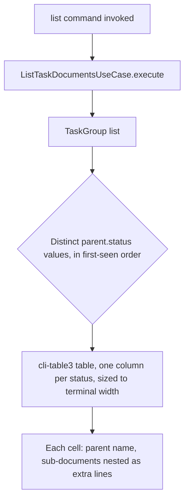

# Instruction: Presentation: export command (`list`)

## Architecture projection

> Tree of the final files. ✅ create · ✏️ modify · ❌ delete

```txt
.
├── package.json ✏️
├── src
│   └── presentation
│       └── commands
│           └── list-command.ts ✏️
└── tests
    └── presentation
        └── list-command.test.ts ✏️
```

## User Journey



## Tasks to do

### `1)` Add `cli-table3` and build the column table

> Replace the fixed 5-bucket grouping in `list-command.ts` with columns keyed by each parent's own literal status.

1. Add `cli-table3` to `package.json` dependencies.
2. In `src/presentation/commands/list-command.ts`, derive the set of distinct `parent.status` values present in the `TaskGroup[]` result, in first-seen order, and use each as a `cli-table3` column header.
3. Render each group under its status column: the parent's name on one line, then one line per sub-document as `- {name}: {status}`, in the same cell.
4. Let `cli-table3` size columns to `process.stdout.columns` when available; fall back to a fixed sane width when not a TTY (e.g. piped output).
5. Keep `--type`/`--status`/`--progress` options working unchanged against the new `TaskGroup`-based use case.

## Test acceptance criteria

| Task | Acceptance criteria                                                                                                 |
| ---- | ---------------------------------------------------------------------------------------------------------------------- |
| 1... | Running `list` against a project shows one column per distinct parent status present, headed by that literal status   |
| 2... | A parent's sub-documents appear nested under it in the same column, each showing its own status as plain text          |
| 2... | A sub-document's own status never moves its parent into a different column                                             |
| 4... | Piping `list`'s output to a file (non-TTY) still produces a bounded-width table instead of throwing or printing unbounded lines |
| End-to-end | A fixture-backed integration test proves a document's `name`/`type`/`status` from `aidd_docs` reaches the printed table unaltered |
