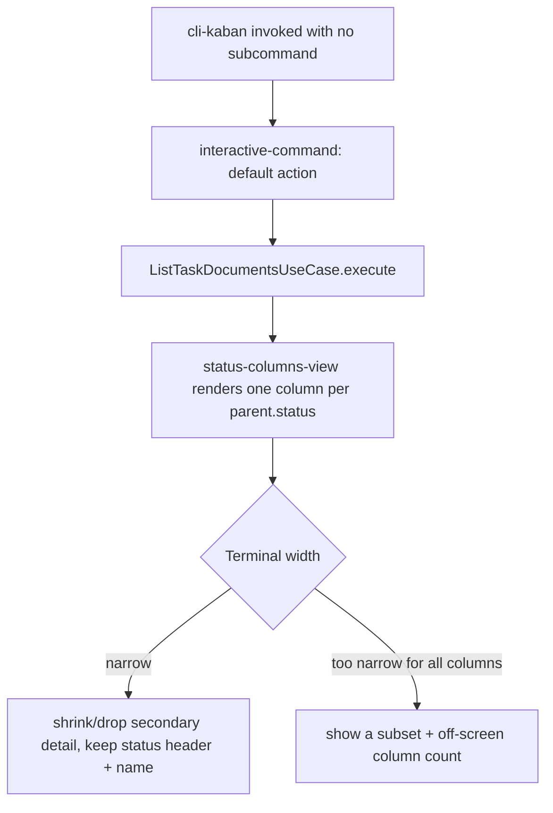

# Instruction: Presentation: interactive command (primary)

## Architecture projection

> Tree of the final files. ✅ create · ✏️ modify · ❌ delete

```txt
.
├── package.json ✏️
├── tsconfig.json ✏️
├── README.md ✏️
├── src
│   ├── cli.ts ✏️
│   └── presentation
│       ├── commands
│       │   └── interactive-command.ts ✅
│       └── components
│           ├── status-columns-view.tsx ✅
│           └── status-column.tsx ✅
└── tests
    └── presentation
        ├── status-columns-view.test.tsx ✅
        └── interactive-command.test.ts ✅
```

## User Journey



## Wireframe

```txt
Screen A — normal terminal width
┌──────────────────────────────────────────────────────────────────────┐
│ (1) cli-kaban — interactive                                          │
├───────────────┬────────────────┬───────────────┬─────────────────────┤
│ (2) PENDING    │ (2) IN-PROGRESS│ (2) DONE       │ (2) COMPLETED       │
│ Plan A         │ Plan B         │ Plan C         │ Plan D              │
│  (3) - phase-1: pending          │  - phase-1: done│  - review: done   │
│  (3) - phase-2: unknown          │                │                    │
│ Plan E         │                │                │                    │
├───────────────┴────────────────┴───────────────┴─────────────────────┤
│ (4) ↑/↓ select · q quit                                               │
└──────────────────────────────────────────────────────────────────────┘

Screen B — narrow terminal width
┌────────────────────────────────┐
│ (1) cli-kaban                   │
├───────────────┬─────────────────┤
│ (2) PENDING    │ (2) IN-PROGR…  │
│ Plan A         │ Plan B          │
│  (3) - phase-1 │                │
├───────────────┴─────────────────┤
│ (4) ↑/↓ select · q quit          │
│ (5) ‹ 2/4 columns · → more ›     │
└────────────────────────────────┘
```

1. Header: tool name; drops any subtitle first when width is tight.
2. Column header: the parent's own literal status string, one column per distinct value present — the last thing to truncate.
3. Sub-document row: nested under its parent, plain `- name: status` text, never altering the parent's column.
4. Footer: keyboard hint bar, always kept.
5. Footer: column-position indicator when not all columns fit on screen.

## Tasks to do

### `1)` Reinstate Ink and build the status-columns view

> Same `TaskGroup[]` data the export uses, rendered as an interactive, width-aware column layout.

1. Add `ink`, `react`, `@types/react` back to `package.json`; restore `"jsx": "react-jsx"` in `tsconfig.json`.
2. Build `status-column.tsx` (dumb: renders one column's header and its groups, given already-computed width and items) and `status-columns-view.tsx` (smart: owns `process.stdout.columns`, computes how many columns fit and what to shrink/drop, fetches data via `ListTaskDocumentsUseCase`).
3. Truncation order when width is tight: drop everything but status header + parent name first, then reduce the number of simultaneously visible columns, only shortening the status header or name text itself as the last resort.
4. Guard for a non-TTY `process.stdout.columns` (undefined) with a sane fallback width.

### `2)` Wire it in as the primary command

> `cli-kaban` with no subcommand launches the interactive view; `list` keeps working as the explicit export.

1. In `src/cli.ts`, register the interactive view as the program's default action (no subcommand needed) and keep `registerListCommand` as an explicit `list` subcommand.
2. Update `README.md`: interactive view documented as the primary way to run the tool, `list` documented as the scriptable export.

## Test acceptance criteria

| Task | Acceptance criteria                                                                                       |
| ---- | -------------------------------------------------------------------------------------------------------- |
| 1... | Rendering against a fixture-backed `TaskGroup[]` shows one column per distinct parent status, sub-documents nested beneath their parent |
| 1... | Narrowing the simulated terminal width keeps status header and parent name legible, dropping other detail first |
| 2... | Running `cli-kaban` with no arguments launches the interactive view; `cli-kaban list` still produces the export |
| End-to-end | A fixture-backed test proves a document's `name`/`type`/`status` reaches the rendered interactive output unaltered |
