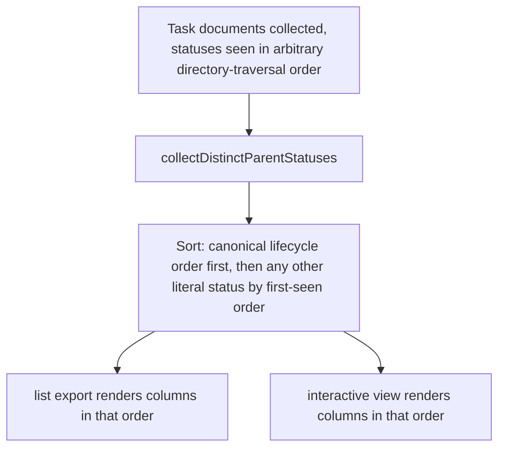

<!-- Fill or omit these sections; never add, rename, or reorder one. -->

# Instruction: Canonical status column ordering

## Architecture projection

> Tree of the final files. ✅ create · ✏️ modify · ❌ delete

```txt
.
└── src/
    └── presentation/
        └── status-grouping.ts        ✏️ sort collectDistinctParentStatuses by canonical lifecycle order
tests/
└── presentation/
    └── status-grouping.test.ts       ✅ unit tests for the new ordering
```

## User Journey



## Tasks to do

### `1)` Sort distinct parent statuses by canonical lifecycle order

> Both the `list` export and the interactive view already call `collectDistinctParentStatuses` through the shared `status-grouping.ts`; fixing the order there fixes both consumers at once.

1. Add a canonical order constant to `status-grouping.ts`: `["pending", "in-progress", "implemented", "reviewed", "blocked"]`, matching this project's own plan-status lifecycle.
2. Change `collectDistinctParentStatuses` to return statuses ordered by that canonical list first; any status not in the list keeps its original first-seen relative order and is appended after every canonical status present.
3. Leave `groupTaskGroupsByParentStatus` untouched — it already takes the (now-ordered) status list as an argument and just buckets by it.

## Test acceptance criteria

<!-- Each criterion is an observable behavior, not a command. -->

| Task | Acceptance criteria                                                                                                   |
| ---- | -------------------------------------------------------------------------------------------------------------------- |
| 1    | Given task groups whose parents are encountered in the order in-progress, implemented, pending, the returned column order is pending, in-progress, implemented |
| 1    | A literal status outside the canonical list (e.g. "completed") is appended after every canonical status present, in first-seen order relative to other non-canonical statuses |
| 1    | Both `list-command.ts` and `status-columns-view.tsx` reflect the new order with no changes of their own, since both consume the shared helper |
