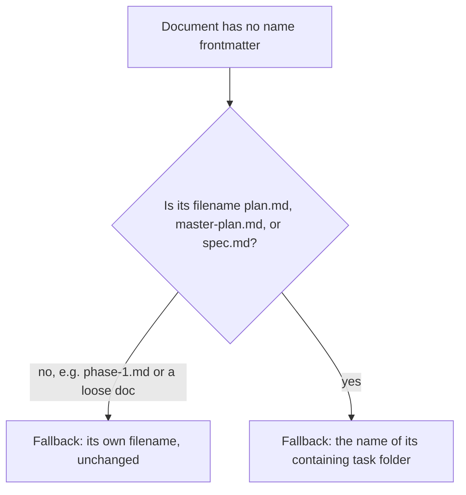

<!-- Fill or omit these sections; never add, rename, or reorder one. -->

# Instruction: Folder-name fallback for plan/master-plan/spec

## Architecture projection

> Tree of the final files. ✅ create · ✏️ modify · ❌ delete

```txt
.
└── src/
    ├── domain/
    │   └── models/
    │       ├── task-group.ts                              ✏️ export isParentEligibleFileName, reuse it in electParent
    │       └── task-name-fallback.ts                       ✅ resolveTaskDocumentNameFallback(filePath)
    └── infrastructure/
        └── filesystem/
            └── filesystem-task-document-repository.ts      ✏️ use the new fallback for the name field
tests/
├── domain/
│   └── task-name-fallback.test.ts                          ✅ unit tests for the new pure function
└── infrastructure/
    └── filesystem-task-document-repository.test.ts          ✏️ add an integration case for a nameless plan.md
```

## User Journey



## Tasks to do

### `1)` Extract the parent-eligible filename check

> `task-group.ts` already knows which filenames elect as a group's parent (`plan.md`/`master-plan.md` primary, `spec.md` fallback); the name-fallback needs that exact same rule, not a second copy of it.

1. Pull the `PARENT_FILE_NAMES` / `FALLBACK_PARENT_FILE_NAME` check used by `electParent` into an exported `isParentEligibleFileName(fileName: string): boolean`.
2. Have `electParent` call it instead of duplicating the check inline.

### `2)` Add the folder-name fallback resolver

> Pure, framework-free: given a file path, decide the display name to use when frontmatter has no `name`. No directory-depth math — `plan.md`/`master-plan.md`/`spec.md` never carry a `name` field by construction (confirmed against `plan-template.md` and this repo's own `spec.md`), so their own filename is never useful.

1. In a new `task-name-fallback.ts`, when `isParentEligibleFileName(basename(filePath))` is true, return `basename(dirname(filePath))` — the containing task folder's name.
2. Otherwise, return `basename(filePath, ".md")` — today's behavior, unchanged, for `phase-1.md` and any other document.

### `3)` Wire the resolver into the repository

1. Replace `toTaskDocument`'s current `basename(filePath, ".md")` fallback for `name` with `resolveTaskDocumentNameFallback(filePath)`.
2. Confirm the existing `malformed-yaml.md` fixture test still passes unchanged: that filename isn't parent-eligible, so it keeps falling back to its own name.

## Test acceptance criteria

<!-- Each criterion is an observable behavior, not a command. -->

| Task | Acceptance criteria                                                                                                          |
| ---- | ------------------------------------------------------------------------------------------------------------------------------ |
| 2    | A `plan.md` with no `name`, in `tasks/<yyyy_mm>/2026_07_19_list-status-columns/plan.md`, displays "2026_07_19_list-status-columns" instead of "plan" |
| 2    | A `spec.md` with no `name` displays its own task folder's name, the same way `plan.md` does                                     |
| 2    | A `phase-1.md` with no `name` still displays its own filename, "phase-1" — unaffected by the new rule                          |
| 3    | The full existing fixture-verified frontmatter extraction suite still passes unchanged                                        |
| 3    | Running `list` against this repo's own `aidd_docs` no longer shows repeated, indistinguishable "plan" titles across different tasks |
