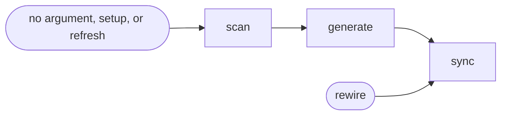

# Project Memory

## Actions

Run the flow above. Read only the next action file.

| Action   | Does                       |
| -------- | -------------------------- |
| scan     | read the project           |
| generate | write the memory           |
| sync     | pick the tools, wire it in |

## Transversal rules

- If a referenced file cannot be read, stop and say so. Never invent its content.
- Ask before anything ambiguous. Never default silently.
- Create or revise a file, keeping the user's edits. Delete one only when the user asks.
- End with a short report of what changed.
