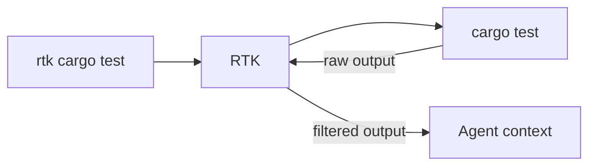
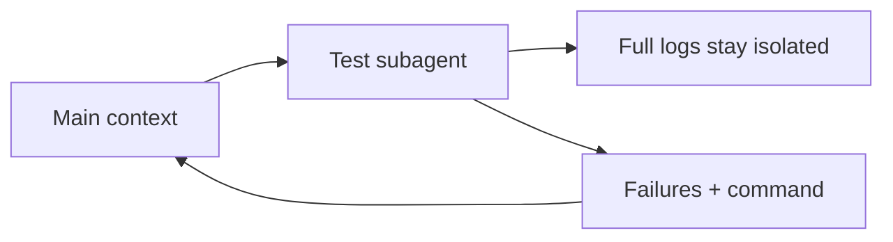

# Token optimization techniques

Cut token usage across coding agents with client-specific commands and measurable checks.

- [Token optimization techniques](#token-optimization-techniques)
  - [Why](#why)
  - [Steps to cut token usage](#steps-to-cut-token-usage)
    - [🟢 Beginner](#-beginner)
      - [1) 📏 Measure session usage](#1--measure-session-usage)
      - [2) 📟 Keep usage visible](#2--keep-usage-visible)
      - [3) 📊 Analyze local history](#3--analyze-local-history)
      - [4) 🔎 Inspect Claude's loaded context](#4--inspect-claudes-loaded-context)
      - [5) ✂️ Keep AGENTS.md and CLAUDE.md short](#5-️-keep-agentsmd-and-claudemd-short)
      - [6) 🎯 Scope rules to matching files](#6--scope-rules-to-matching-files)
      - [7) 🧩 Load skills only on demand](#7--load-skills-only-on-demand)
      - [8) 🧠 Disable stale auto-memory](#8--disable-stale-auto-memory)
      - [9) 🪨 Compress instruction files with Caveman](#9--compress-instruction-files-with-caveman)
      - [10) 🧭 Plan before expensive work](#10--plan-before-expensive-work)
      - [11) ♻️ Reset unrelated work](#11-️-reset-unrelated-work)
      - [12) 🗜️ Compact the same task](#12-️-compact-the-same-task)
    - [🟡 Intermediate](#-intermediate)
      - [13) 📈 Export token telemetry](#13--export-token-telemetry)
      - [14) 🗣️ Set native concise output](#14-️-set-native-concise-output)
      - [15) 🪨 Compress output with Caveman](#15--compress-output-with-caveman)
      - [16) 🧠 Shape actionable output with i-have-adhd](#16--shape-actionable-output-with-i-have-adhd)
      - [17) 🧹 Filter shell output with RTK](#17--filter-shell-output-with-rtk)
      - [18) ✂️ Filter shell output with SNIP](#18-️-filter-shell-output-with-snip)
      - [19) 🪝 Rewrite noisy commands with hooks](#19--rewrite-noisy-commands-with-hooks)
      - [20) ✋ Cap Codex tool history](#20--cap-codex-tool-history)
      - [21) 🚫 Block bulky paths](#21--block-bulky-paths)
      - [22) 🔌 Limit MCP exposure](#22--limit-mcp-exposure)
    - [🔴 Expert](#-expert)
      - [23) 🔬 Inspect model-visible behavior](#23--inspect-model-visible-behavior)
      - [24) 🎯 Route model and effort by difficulty](#24--route-model-and-effort-by-difficulty)
      - [25) 🧫 Isolate noisy work with subagents](#25--isolate-noisy-work-with-subagents)
      - [26) 🧊 Preserve Claude prompt-cache prefixes](#26--preserve-claude-prompt-cache-prefixes)
      - [27) ✅ Lower reasoning on routine work](#27--lower-reasoning-on-routine-work)
  - [Verify the result](#verify-the-result)
  - [In short](#in-short)


## Why

**Input tokens** come from instructions, history, tools, and logs.

**Output tokens** come from verbosity and reasoning effort.

## Steps to cut token usage

### 🟢 Beginner

#### 1) 📏 Measure session usage

Run the native counter after each feature and compare only equivalent tasks.

| Client | Command | Measures |
| --- | --- | --- |
| Claude Code | `/usage` (`/cost`, `/stats`) | Session tokens, estimated cost, and supported attribution |
| Codex | `/status`; `/usage daily`, `/usage weekly`, `/usage cumulative` | Current context and account token activity |

See [Claude Code costs](https://code.claude.com/docs/en/costs) and [Codex commands](https://learn.chatgpt.com/docs/developer-commands?surface=cli).

#### 2) 📟 Keep usage visible

Use the native status line instead of asking the model for usage.

```text
Claude Code: /statusline
Codex:       /statusline
```


See [Claude Code status lines](https://code.claude.com/docs/en/statusline).

#### 3) 📊 Analyze local history

Use local logs when one session counter is insufficient.

| Need | Tool | Command |
| --- | --- | --- |
| Aggregate supported coding agents | [`ccusage`](https://github.com/ccusage/ccusage) | `npx ccusage@latest` |
| Inspect individual Claude Code prompts | [`prompt-analytics-for-claude-code`](https://github.com/romainfjgaspard/prompt-analytics-for-claude-code) | `uvx --from prompt-analytics-for-claude-code prompt-analytics summary` |

Local logs can contain prompt text. Treat exports as sensitive.


#### 4) 🔎 Inspect Claude's loaded context

Target the largest source shown by Claude Code.

```text
/context all
/memory
```

#### 5) ✂️ Keep AGENTS.md and CLAUDE.md short

Keep durable constraints and validation commands. Remove architecture prose, task notes, and duplicated instructions.

| Client | Persistent file |
| --- | --- |
| Claude Code | `CLAUDE.md` |
| Codex | `AGENTS.override.md` when present, otherwise `AGENTS.md` |
| GitHub Copilot | `.github/copilot-instructions.md` |

```md
# Persistent instructions

- Lead with the result.
- Preserve unrelated changes.
- Run the smallest relevant validation.
- Quote only the decisive error line.
```

See the local [AGENTS.md template](../../../02-project-memory/assets/AGENTS.md), [Claude Code memory](https://code.claude.com/docs/en/memory), and [Codex AGENTS.md](https://learn.chatgpt.com/docs/agent-configuration/agents-md).

#### 6) 🎯 Scope rules to matching files

Move file-specific guidance out of the root instruction file.

Claude Code `.claude/rules/api.md`:

```md
---
paths:
  - "src/api/**/*.ts"
---

- Validate every API input.
- Use the standard error response.
```

Codex `src/api/AGENTS.md`:

```md
# API rules

- Validate every API input.
- Use the standard error response.
```

#### 7) 🧩 Load skills only on demand

Hide manual Claude skills and disable unused Codex skills.

Claude Code skill frontmatter:

```yaml
---
name: deploy
description: Deploy the application
disable-model-invocation: true
---
```

Codex `config.toml`:

```toml
[[skills.config]]
path = "/absolute/path/to/skill"
enabled = false
```

An invoked skill stays in the session context. Keep its body short.

#### 8) 🧠 Disable stale auto-memory

Disable memory only when repeated rediscovery costs less than loading it.

Claude Code `.claude/settings.local.json`:

```json
{
  "autoMemoryEnabled": false
}
```

Codex `config.toml` when experimental Memories are enabled:

```toml
[memories]
use_memories = false
generate_memories = false
```

Inspect first with Claude Code `/memory` or Codex `/memories`.

#### 9) 🪨 Compress instruction files with Caveman

Run `caveman-compress`, inspect the diff, then restore any weakened constraint.

```bash
# Claude Code
claude plugin marketplace add JuliusBrussee/caveman
claude plugin install caveman@caveman
# Invoke: /caveman:caveman-compress CLAUDE.md

# Codex
npx skills add JuliusBrussee/caveman -a codex
# Invoke: $caveman-compress AGENTS.md
```

See [Caveman's install matrix and benchmarks](https://github.com/JuliusBrussee/caveman/blob/main/README.md).

#### 10) 🧭 Plan before expensive work

Plan only when a wrong implementation would cost more than the planning turn.

| Client | Command |
| --- | --- |
| Claude Code | `/plan`, or `claude --permission-mode plan` |
| Codex | `/plan` |

```text
/plan Propose the smallest implementation and its validation before editing
```

See [Claude Code permission modes](https://code.claude.com/docs/en/permission-modes) and [Codex best practices](https://learn.chatgpt.com/guides/best-practices).

#### 11) ♻️ Reset unrelated work

Start a fresh context when the goal changes.

| Situation | Claude Code | Codex |
| --- | --- | --- |
| New task | `/clear` | `/new` |
| Abandon a wrong branch | `/rewind` | Start or fork a chat |
| Disposable aside | `/btw` | `/side` or `/btw` |

#### 12) 🗜️ Compact the same task

Keep the goal, decisions, failing evidence, and next validation.

```text
Claude Code: /compact keep the repro and failing test; drop file dumps
Codex:       /compact
```

See [Claude Code commands](https://code.claude.com/docs/en/commands) and [Codex commands](https://learn.chatgpt.com/docs/developer-commands?surface=cli).

### 🟡 Intermediate

#### 13) 📈 Export token telemetry

Export structured metrics without prompt or tool content.

Claude Code:

```bash
CLAUDE_CODE_ENABLE_TELEMETRY=1 \
OTEL_METRICS_EXPORTER=otlp \
OTEL_EXPORTER_OTLP_METRICS_ENDPOINT=http://localhost:4318/v1/metrics \
OTEL_EXPORTER_OTLP_METRICS_PROTOCOL=http/protobuf \
claude
```

Codex `config.toml`:

```toml
[otel]
environment = "dev"
log_user_prompt = false
exporter = { otlp-http = { endpoint = "http://localhost:4318/v1/logs", protocol = "binary" } }
```

See [Claude Code monitoring](https://code.claude.com/docs/en/monitoring-usage) and [Codex observability](https://learn.chatgpt.com/docs/config-file/config-advanced#observability-and-telemetry).

#### 14) 🗣️ Set native concise output

Preserve code, errors, evidence, and security warnings. Remove filler.

Claude Code `.claude/output-styles/concise-coding.md`:

```md
---
name: Concise coding
description: Short, evidence-preserving coding responses
keep-coding-instructions: true
---

Answer directly. Preserve code, decisive errors, evidence, and security warnings; omit filler.
```

Codex `config.toml`:

```toml
model_verbosity = "low"
model_reasoning_summary = "concise"
```

`model_reasoning_summary` changes the reasoning summary, not the final answer. See [Claude Code output styles](https://code.claude.com/docs/en/output-styles) and [Codex configuration](https://learn.chatgpt.com/docs/config-file/config-reference).

#### 15) 🪨 Compress output with Caveman

Use `lite` first. Stronger modes trade readability for fewer output tokens.

```bash
# Claude Code
claude plugin marketplace add JuliusBrussee/caveman
claude plugin install caveman@caveman
# Invoke: /caveman:caveman lite

# Codex
npx skills add JuliusBrussee/caveman -a codex
# Invoke: $caveman lite
```

```text
Before:
The reason your React component is re-rendering is likely because you create a new object reference on each render. When you pass an inline object as a prop, React's shallow comparison sees a different object every time. Wrap the object in `useMemo`.

After:
New object ref each render. Inline object prop = new ref = re-render. Wrap in `useMemo`.
```

The maintainer reports 65% fewer output tokens on a small chat benchmark. A [JetBrains benchmark](https://blog.jetbrains.com/ai/2026/07/speak-to-ai-agents-like-cavemen-tosave-tokens/) measured 8.5% on agentic coding tasks. Measure your workload.

#### 16) 🧠 Shape actionable output with i-have-adhd

Use [`i-have-adhd`](https://github.com/ayghri/i-have-adhd) for action-first output, not guaranteed compression.

```bash
# Claude Code
claude plugin marketplace add ayghri/i-have-adhd
claude plugin install i-have-adhd@i-have-adhd
# Invoke: /i-have-adhd:i-have-adhd

# Codex
codex plugin marketplace add ayghri/i-have-adhd --ref main
codex plugin add i-have-adhd@i-have-adhd
# Invoke: $i-have-adhd
```

Canonical output example:

```text
Run `npm install jsonwebtoken@latest`, then edit `src/auth.ts:42`.

1. Open `src/auth.ts`
2. Replace `verifyToken` (lines 42–58) with the snippet below
3. Run `npm test -- auth.spec.ts`

Next: paste the first failing line if any test fails.
```

| Need | Use |
| --- | --- |
| Maximum prose compression | Caveman |
| Action-first structure | `i-have-adhd` |
| Both | `i-have-adhd`, then Caveman `lite`; benchmark the combination |

Stop one mode with `stop adhd mode` or `stop caveman`. `normal mode` stops both. See the [installation matrix](https://github.com/ayghri/i-have-adhd/blob/main/INSTALL.md) and [rules](https://github.com/ayghri/i-have-adhd/blob/main/skills/i-have-adhd/SKILL.md).

#### 17) 🧹 Filter shell output with RTK

Run RTK only for commands whose raw output is materially noisy.

```bash
brew install rtk
rtk gain
rtk cargo test
```



A [JetBrains benchmark](https://blog.jetbrains.com/ai/2026/07/rtk-claude-code-token-savings/) found no cost improvement on its workload. Measure before automating.

#### 18) ✂️ Filter shell output with SNIP

Use YAML filters when RTK's fixed command set does not fit.

```bash
brew install edouard-claude/tap/snip
snip init                # Claude Code
snip init --agent codex  # Codex
```

See [`SNIP`](https://github.com/edouard-claude/snip).

#### 19) 🪝 Rewrite noisy commands with hooks

Rewrite only known commands. Keep unknown commands fail-open.

```bash
rtk init -g          # Claude Code
rtk init -g --codex  # Codex
```

Verify with `/hooks`. See [Claude Code filtering hooks](https://code.claude.com/docs/en/costs#offload-processing-to-hooks-and-skills) and [Codex hooks](https://learn.chatgpt.com/docs/hooks).

#### 20) ✋ Cap Codex tool history

Limit stored tool output only after raw diagnostics have been captured.

```toml
tool_output_token_limit = 12000
```

Raise or remove the limit when evidence is truncated.

#### 21) 🚫 Block bulky paths

Prevent accidental reads of generated output and dependency trees.

Claude Code `.claude/settings.json`:

```json
{
  "$schema": "https://json.schemastore.org/claude-code-settings.json",
  "permissions": {
    "deny": [
      "Read(./.env)",
      "Read(./.env.*)",
      "Read(./secrets/**)",
      "Read(./vendor/**)",
      "Read(./dist/**)"
    ]
  }
}
```

This saves tokens only when the agent would otherwise read those paths. Secrets are primarily a security concern. See [Claude Code permissions](https://code.claude.com/docs/en/permissions).

#### 22) 🔌 Limit MCP exposure

Disable unused servers and tools.

| Client | Control |
| --- | --- |
| Claude Code | Tool Search defers supported MCP schemas; avoid unnecessary `alwaysLoad` |
| Codex | `/mcp verbose`; `enabled = false`; `enabled_tools`; `disabled_tools` |

```toml
[mcp_servers.figma]
url = "https://mcp.figma.com/mcp"
enabled = false
```

See [Claude Code MCP](https://code.claude.com/docs/en/mcp#scale-with-mcp-tool-search), [Codex MCP](https://learn.chatgpt.com/docs/extend/mcp?surface=cli), and [`mcp-installation.md`](mcp-installation.md).

### 🔴 Expert

#### 23) 🔬 Inspect model-visible behavior

Use diagnostics native to each client.

```text
Claude Code: /insights
Claude Code: Ctrl+O
Codex:       codex debug prompt-input [PROMPT]
```

Codex `Ctrl+O` copies the latest completed response. See [Claude Code commands](https://code.claude.com/docs/en/commands) and [Codex commands](https://learn.chatgpt.com/docs/developer-commands?surface=cli).

#### 24) 🎯 Route model and effort by difficulty

Use cheaper agents for bounded exploration. Keep difficult review and architecture on stronger settings.

Claude Code `.claude/agents/explorer.md`:

```yaml
---
name: explorer
description: Read-only codebase scout
tools: Read, Grep, Glob
model: haiku
effort: low
---
```

Codex `.codex/agents/explorer.toml`:

```toml
name = "explorer"
description = "Read-only codebase scout"
developer_instructions = "Explore without edits. Return paths, symbols, and decisive evidence only."
model = "gpt-5.6-terra"
model_reasoning_effort = "low"
```

See [Claude Code model configuration](https://code.claude.com/docs/en/model-config) and [Codex subagents](https://learn.chatgpt.com/docs/agent-configuration/subagents).

#### 25) 🧫 Isolate noisy work with subagents

Return only findings, evidence, blockers, and the command used.

```text
Delegate the test run. Return only failing tests, the shortest decisive error, and the command used.
```



Subagents reduce main-context noise, not total token usage. See [Claude Code subagents](https://code.claude.com/docs/en/sub-agents) and [Codex subagents](https://learn.chatgpt.com/docs/agent-configuration/subagents).

#### 26) 🧊 Preserve Claude prompt-cache prefixes

Choose model, effort, and MCP tools before the first substantive prompt.


```text
/model sonnet
/effort medium
```

For Codex, observe `cached_input` through telemetry. See [Claude Code prompt caching](https://code.claude.com/docs/en/prompt-caching) and [Codex observability](https://learn.chatgpt.com/docs/config-file/config-advanced#observability-and-telemetry).

#### 27) ✅ Lower reasoning on routine work

Lower effort first. Disable thinking only when a representative task still passes.

```text
Claude Code: /effort low
Codex:       /reasoning
```

Claude Code `.claude/settings.json`:

```json
{
  "env": {
    "CLAUDE_CODE_DISABLE_THINKING": "1"
  }
}
```

Codex `config.toml`:

```toml
model_reasoning_effort = "low"
```

See [Claude Code model configuration](https://code.claude.com/docs/en/model-config) and [Codex configuration](https://learn.chatgpt.com/docs/config-file/config-reference).

## In short

Measure first. Change one token source at a time. Keep only measured wins.

Have more clues? Open a [pull request](../../../../../../CONTRIBUTING.md).
