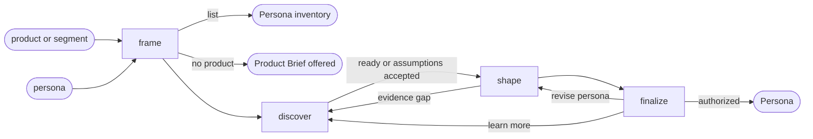

# Persona

## Actions

Run the flow above. Read only the next action file.

| Action   | Does                                |
| -------- | ------------------------------------ |
| frame    | resolve the product, the case, and the evidence path |
| discover | research, question, and challenge     |
| shape    | compose one persona                   |
| finalize | refine, approve, and persist          |

## Transversal rules

- Keep product decisions with the user.
- Separate evidence, decisions, and assumptions.
- Ask natural questions; never expose actions, references, or unchanged state.
- Require explicit approval or caller-provided bounded authority before any write.
