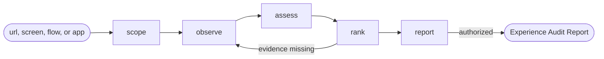

# Experience Audit

## Actions

Run the flow above. Read only the next action file.

| Action  | Does                                           |
| ------- | ----------------------------------------------- |
| scope   | choose what to audit and for whom                |
| observe | capture evidence across screens and states       |
| assess  | apply every expert lens through every persona    |
| rank    | score and shortlist the top premium gaps         |
| report  | compose, approve, and persist the audit          |

## Transversal rules

- Stay read-only: never change application source.
- Treat every lens as an analytical tool, not an authority.
- Cite evidence and the persona hurt on every finding.
- Ground personas in the product.
- Never recommend a dark pattern.
- Run every lens sequentially in this context; never spawn an agent.
- Discover every capability at runtime, by description only, never by plugin or skill name.
- Require explicit approval or caller-provided bounded authority before any write.
