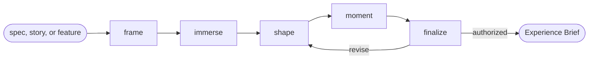

# Experience Design

## Actions

Run the flow above. Read only the next action file.

| Action   | Does                                          |
| -------- | ---------------------------------------------- |
| frame    | ground the feature, its personas, and constraints |
| immerse  | live each persona's situation, job, and emotional arc |
| shape    | compose the flow, screens, and states          |
| moment   | name the memorable moment and its motivation hook |
| finalize | refine, approve, and persist                   |

## Transversal rules

- Decide the what and why; never the layout or the visuals.
- Ask natural questions; never expose actions, references, or unchanged state.
- Require explicit approval or caller-provided bounded authority before any write.
