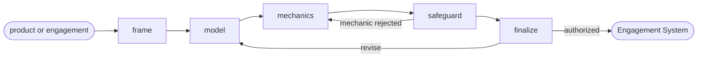

# Engagement System

## Actions

Run the flow above. Read only the next action file.

| Action    | Does                                            |
| --------- | ------------------------------------------------ |
| frame     | scope the product, personas, and the core action |
| model     | build the motivation model and core loop          |
| mechanics | select and calibrate mechanics                    |
| safeguard | check every mechanic against the ethics guardrails |
| finalize  | refine, approve, and persist                       |

## Transversal rules

- Never propose a dark pattern.
- Require explicit approval or caller-provided bounded authority before any write.
