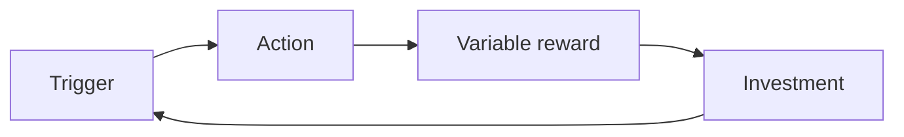

# Loop

The core loop that repeats the confirmed core action, its habit rhythm, its triggers, and return triggers that avoid guilt.

## Core loop

| Stage | Definition |
| --- | --- |
| Trigger | what prompts the user to start the core action, internal or external |
| Action | the core action itself, the simplest version that still counts |
| Variable reward | feedback that is satisfying but not perfectly predictable in size or form |
| Investment | something the user puts in that makes the next loop more likely or more valuable (data, streak, content, reputation) |

## Habit rhythm

| Rhythm | Use when |
| --- | --- |
| Daily | the core action is small enough to repeat every day without fatigue |
| Weekly | the core action is naturally periodic (a review, a report, a check-in) |
| Event-driven | the core action responds to something that happens outside a fixed schedule (a bill, a claim, a match) |

## Triggers

| Type | Source | Example |
| --- | --- | --- |
| Internal | the persona's own need or emotion | boredom, curiosity, a felt gap, a recurring task |
| External | product-initiated | a notification, an email, a badge unlocked |

## Return triggers that avoid guilt

| Pattern | Why it avoids guilt |
| --- | --- |
| "your weekly recap is ready" | invites reflection, states a fact, no threat |
| "something new is ready to see" | curiosity-driven, no loss framing |
| "your claim moved forward" | progress-driven, informative |
